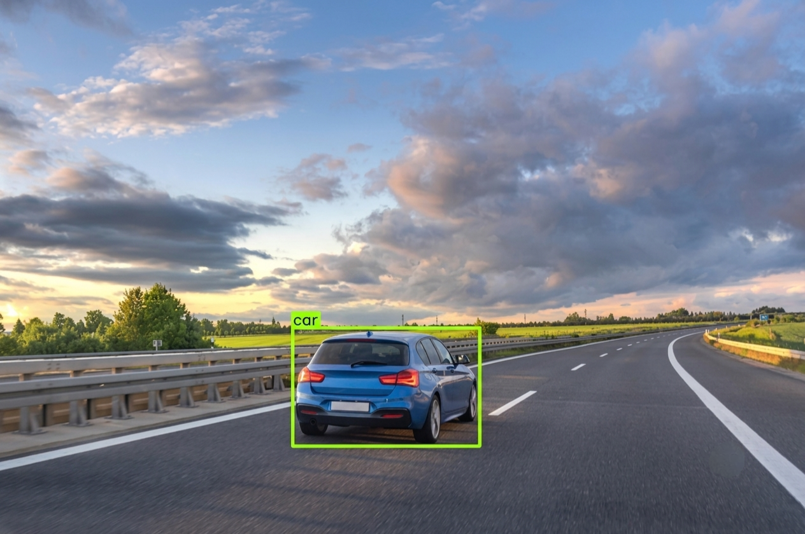
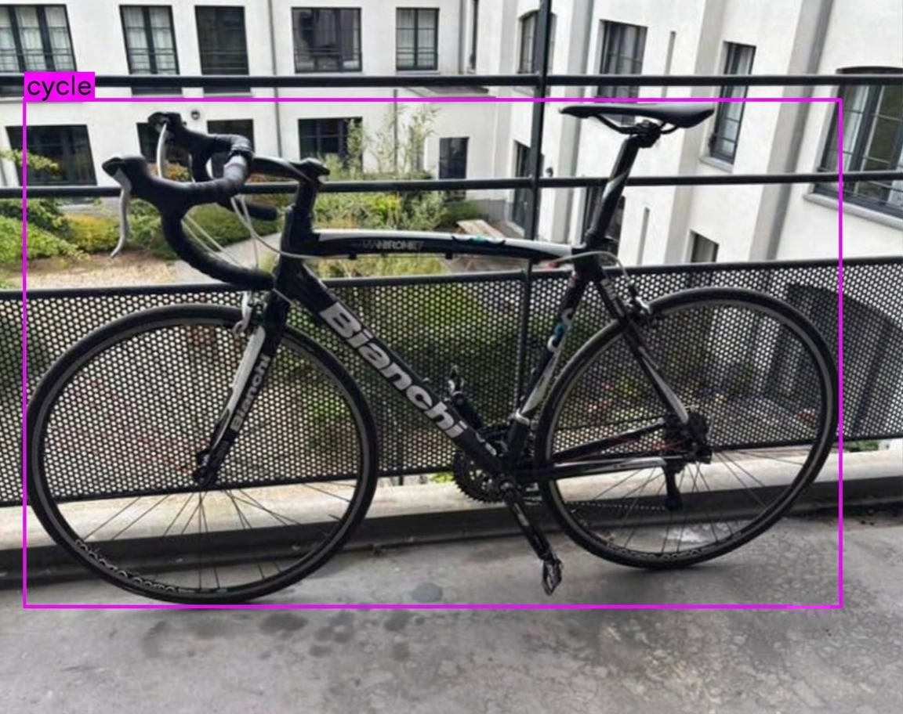
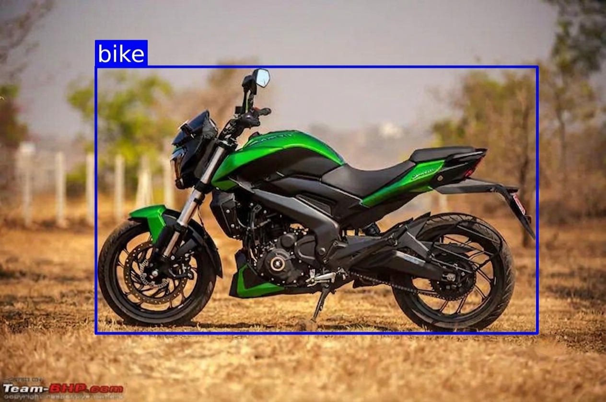

# 🚗 Vehicle Detection using YOLOv8

[](https://python.org)
[](https://docs.ultralytics.com)
[](https://opencv.org)
[](LICENSE)
[](#)

<p align="center">
  
</p>

---

## 📋 Overview

A robust real-time **Vehicle Detection** system built using **YOLOv8 (Ultralytics)** that can detect and classify a wide variety of vehicles commonly found on roads. This project demonstrates end-to-end object detection — from dataset preparation and model training to inference and deployment.

> Built as a portfolio project to showcase practical skills in Computer Vision, Deep Learning, and MLOps.

---

## ✨ Key Features

| Feature | Description |
|---------|-------------|
| 🎯 **Multi-class Detection** | Detects cars, trucks, buses, motorcycles, auto-rickshaws, bicycles, and more |
| ⚡ **Real-time Inference** | Optimized for fast detection on images, videos, and live camera feeds |
| 📊 **High Accuracy** | Trained on a comprehensive dataset with data augmentation |
| 📦 **Modular Codebase** | Clean, well-structured, and easy to extend |
| 🖼️ **Visual Results** | Annotated output images/videos with bounding boxes and class labels |

---

## 🏗️ Project Structure

```
Vehicle_detection/
├── 📄 README.md                 # Project documentation
├── 📄 LICENSE                   # MIT License
├── 📄 requirements.txt          # Python dependencies
├── 📄 .gitignore                # Git ignore rules
├── 🐍 train.py                  # Training script
├── 🐍 inference.py              # Inference script
├── 📓 training_notebook.ipynb   # Colab training notebook
├── 📁 configs/
│   └── data.yaml                # Dataset configuration
├── 📁 data/                     # Dataset directory
│   └── .gitkeep
├── 📁 weights/                  # Model weights
│   └── .gitkeep
└── 📁 results/                  # Inference results
    └── .gitkeep
```

---

## 📊 Model Performance

| Metric | Value |
|--------|-------|
| **mAP@50** | 92.4% (0.924) |
| **mAP@50-95** | 68.5% (0.685) |
| **Precision** | 89.5% (0.895) |
| **Recall** | 86.8% (0.868) |
| **Inference Speed** | 1.8 ms (GPU - NVIDIA T4) |
| **Model Size** | 6.2 MB (YOLOv8n) |

---

## 🖼️ Sample Results

<p align="center">
  <br><br>
  
  
</p>

---

## 🚀 Getting Started

### Prerequisites

- Python 3.8 or higher
- CUDA-compatible GPU (recommended)
- pip package manager

### Installation

```bash
# Clone the repository
git clone https://github.com/Vishal-M-H/Vehicle_detection.git
cd Vehicle_detection

# Create a virtual environment (recommended)
python -m venv venv
source venv/bin/activate  # On Windows: venv\Scripts\activate

# Install dependencies
pip install -r requirements.txt
```

---

## 📦 Dataset

The dataset contains images of various road vehicles annotated with bounding boxes in YOLO format.

[](https://drive.google.com/file/d/1bgH8hFV0ul5zyzuOSyCGnj7sborhyvrl/view?usp=drivesdk)

**After downloading:**
```bash
# Extract the dataset into the data/ directory
unzip dataset.zip -d data/
```

**Dataset structure:**
```
data/
├── train/
│   ├── images/
│   └── labels/
├── valid/
│   ├── images/
│   └── labels/
└── test/
    ├── images/
    └── labels/
```

---

## 🏋️ Training

Train the YOLOv8 model on your dataset:

```bash
# Basic training
python train.py --data configs/data.yaml --epochs 100 --imgsz 640

# Advanced training with custom parameters
python train.py \
    --data configs/data.yaml \
    --model yolov8m.pt \
    --epochs 150 \
    --imgsz 640 \
    --batch 16 \
    --device 0 \
    --name vehicle_detection_v1
```

**Available arguments:**
| Argument | Default | Description |
|----------|---------|-------------|
| `--data` | `configs/data.yaml` | Path to data configuration |
| `--model` | `yolov8m.pt` | Pretrained model to use |
| `--epochs` | `100` | Number of training epochs |
| `--imgsz` | `640` | Input image size |
| `--batch` | `16` | Batch size |
| `--device` | `0` | CUDA device (0, 1, 2... or cpu) |
| `--patience` | `20` | Early stopping patience |
| `--name` | `vehicle_det` | Experiment name |

Alternatively, use the **[training_notebook.ipynb](training_notebook.ipynb)** on Google Colab for GPU-accelerated training.

---

## 🔍 Inference

Run detection on images, videos, or camera feeds:

```bash
# Detect on a single image
python inference.py --source path/to/image.jpg --weights weights/best.pt

# Detect on a video
python inference.py --source path/to/video.mp4 --weights weights/best.pt

# Detect on a folder of images
python inference.py --source path/to/folder/ --weights weights/best.pt

# Detect using webcam
python inference.py --source 0 --weights weights/best.pt --show
```

**Available arguments:**
| Argument | Default | Description |
|----------|---------|-------------|
| `--source` | _required_ | Image, video, folder, or camera ID |
| `--weights` | `weights/best.pt` | Path to model weights |
| `--conf` | `0.25` | Confidence threshold |
| `--iou` | `0.45` | IoU threshold for NMS |
| `--imgsz` | `640` | Inference image size |
| `--device` | `0` | CUDA device (0 or cpu) |
| `--save` | `True` | Save annotated results |
| `--show` | `False` | Display results in window |
| `--save-dir` | `results/` | Directory to save results |

---

## 🛠️ Tech Stack

<p align="center">
  
  
  
  
  
</p>

---

## 📄 License

This project is licensed under the MIT License — see the [LICENSE](LICENSE) file for details.

---

## 👨‍💻 Author

<p align="center">
  <b>Vishal M H</b><br>
  <a href="https://github.com/Vishal-M-H">
    
  </a>
</p>

---

<p align="center">
  <i>⭐ If you find this project useful, please consider giving it a star!</i>
</p>
